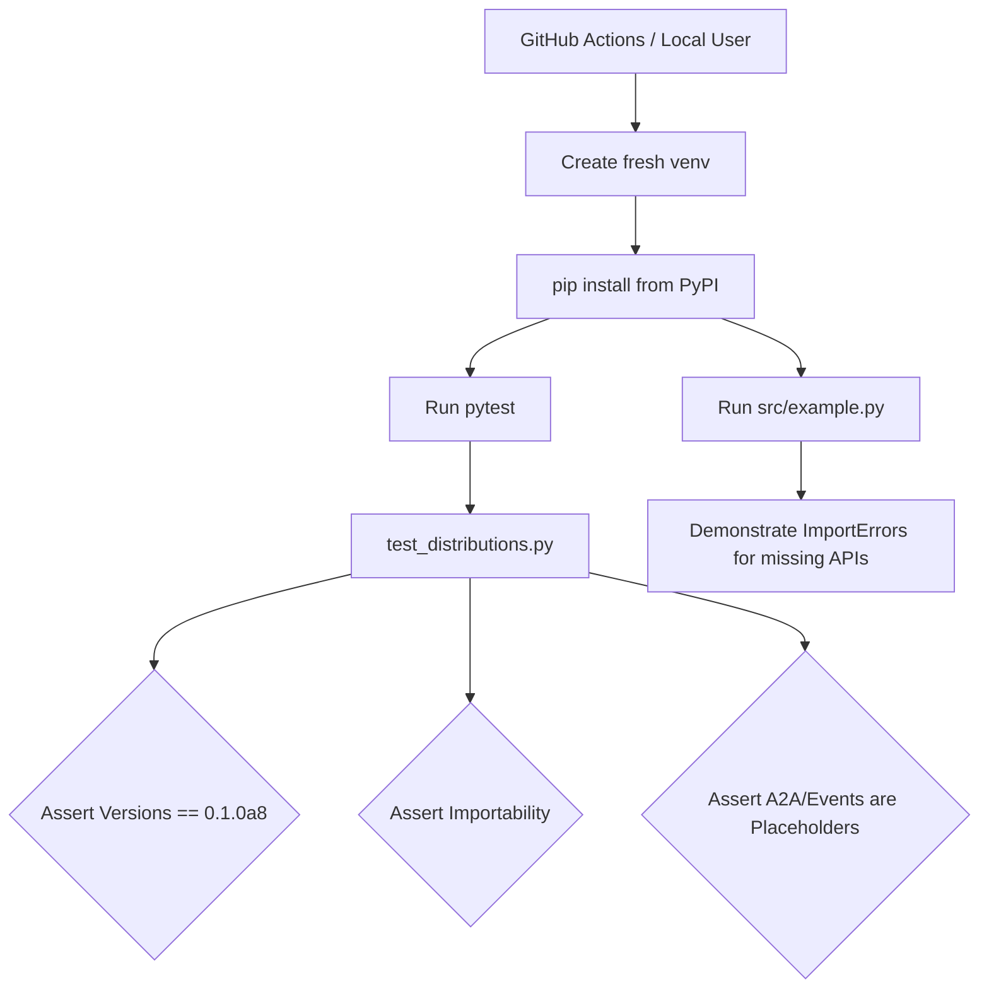

# Architecture

This document describes the architectural flow of the `agnara-a8-distribution-matrix` project.

## Purpose

The architecture of this repository is designed exclusively for **clean-room validation**. It does not build an application; it builds a validation harness to ensure the Agnara ecosystem distributes correctly via PyPI.

## Execution Flow

## Architectural Invariants

1. **Isolation**: The execution MUST happen in an isolated environment.
2. **Immutability**: The target version (`0.1.0a8`) is frozen. This repository does not track `main` of the core repository.
3. **Truthfulness**: The validation suite MUST fail or log an error if an expected API gap is magically filled (e.g., if a developer accidentally mocks `agnara.events`). The architecture requires documenting failures as evidence of the actual state of the release.

## Component Boundaries

- `tests/`: Asserts that the metadata and module structure exactly matches the `0.1.0a8` release expectations.
- `src/example.py`: Acts as the "user-facing" proof of the constraints, demonstrating what happens when a user attempts to use the distributions.
